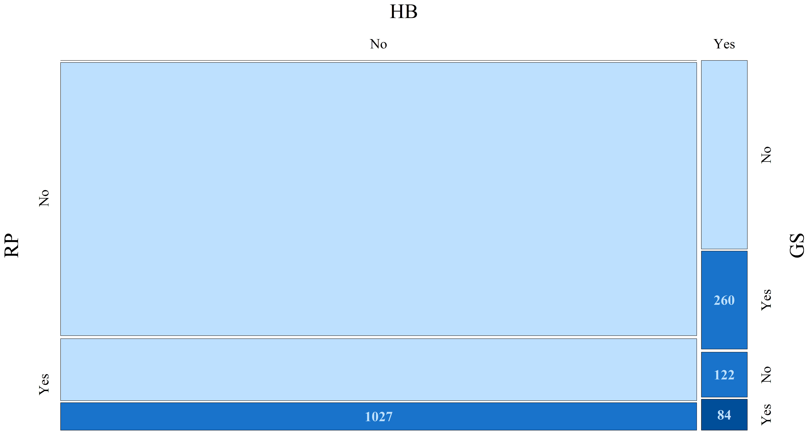

[](http://quantlet.de/index.php?p=info)

## [](http://quantlet.de/) **ARRmosage** [](http://quantlet.de/d3/ia)

```yaml

Name of QuantLet : ARRmosage

Published in : ARR - Academic Rankings Research

Description : 'Produces the mosaic plot of number of researchers, when merging of Handelsblatt
(HB), RePEc (RP) and Google Scholar (GS) rankings takes place'

Keywords : 'mosaic-plot, multivariate, data visualization, analysis, descriptive-methods, graphical
representation, descriptive, multivariate analysis'

See also : 'ARRboxage, ARRboxgscit, ARRboxhb, ARRcormer, ARRdenmer2d, ARRdenmer3d, ARRhexage,
ARRhexcit, ARRhexhin, ARRhismer, ARRmosagegr, ARRmossub, ARRpcpgscit, ARRpcphb, ARRpcpmer,
ARRpcprp, ARRqrqqhb, ARRscaage, ARRscamer'

Author : Alona Zharova

Submitted : Sat, April 30 2016 by Alona Zharova, Marius Sterling

Datafile : 'ARRdata.csv - The data set contains different researcher (3218 rows) of either RePEc
(77 columns), Handelsblatt (48 columns) ranking or both and their Google Scholar data (16 columns)
as well as age and subject fields (2 columns)'

Example : Mosaic plot

Output : 'Mosaic plot for the number of researchers, when merging of HB, RP and GS rankings takes
place or not (Yes/No). The number of GS profiles is quite large and is here shown only figurative.
Ranking data of researchers in 2015 (RP, GS and HB VWL LW) and 2014 (HB BWL LW) have been used'

```




### R Code:
```r
# clear variables
rm(list=ls(all=TRUE))

# load library
# Install Packages
libraries = c("vcd")
lapply(libraries, function(x) if (!(x %in% installed.packages())) {install.packages(x)})
lapply(libraries, library, quietly = TRUE, character.only = TRUE)


# setting (font, color) for output, depending on choice
font        = "serif" #Helvetica"
res         = 300
max         = 255
grey.colors = c("white",
                rgb( 80, 95,108,alpha=108*1.0,maxColorValue = 108),
                rgb(  0, 55,108,alpha=140*0.9,maxColorValue = 140),
                rgb(  0, 55,108,alpha=180*1.0,maxColorValue = 180)
                )

# load data
data = read.csv2("ARRdata.csv", sep = ";", dec = ",", header = T, stringsAsFactors = FALSE)

# Computation of frquency table
freq = data.frame()
tab  = c("Yes","No")
for (i.hb in tab) {
  for (i.rp in tab) {
    for (i.gs in tab) {
      if (i.hb == "Yes") {
        hb = !is.na(data$hb_commonscore)
      } else {
        hb = T
      }
      if (i.rp == "Yes") {
        rp = !is.na(data$rp_rank)
      } else {
        rp = T
      }
      if (i.gs == "Yes") {
        gs = !is.na(data$gs_author)
      } else {
        gs = T
      }
      i = dim(freq)[1] + 1
      freq[i, "HB"] = i.hb
      freq[i, "RP"] = i.rp
      freq[i, "GS"] = i.gs
      if (i.hb == "Yes" | i.rp == "Yes") {
        tmp = dim(data[hb & rp & gs, ])[1]
      } else {
        tmp = ifelse(i.gs == "Yes", 10000, 0)
      }
      freq[i, "Freq"] = tmp
    }
  }
}
freq       = freq[order(freq[,1],freq[,2],freq[,3],decreasing = F),]
colgr      = 1+(freq$HB=="Yes")+(freq$RP=="Yes")+(freq$GS=="Yes")
freq$color = grey.colors[colgr]
m          = freq  

# setting (font, color) for output, depending on choice
font           = "serif" # Font Times
width          = 24      # width of plot pdf
height         = 13      # height of plot pdf
fontsize_big   = 44      # font size of the main titles
fontsize_small = 30      # font size of the axes
marg           = 9       # margin
fontsize_cells = 30      # font size of cell labels


# mosaic plot of age groups against Ranking groups
png(file = "ARRmosage.png", width = width, height = height, units = "in", res = res, family = font)
mosaic(~HB + RP + GS, data = m, gp = gpar(fill = m$color), shade = TRUE, direction = c("v","h", "h"), 
       zero_size = 0, labeling = labeling_values,
       gp_text = gpar(fontsize = fontsize_cells,fontface = 2, col = grey.colors[2]), 
       labeling_args = list(gp_labels = gpar(fontsize = fontsize_small, fontface = 1, fontfamily = font), 
                            gp_varnames = gpar(fontsize = fontsize_big, fontface = 1, fontfamily = font)), 
       keep_aspect_ratio = FALSE, margins = unit(c(marg, marg, 1, marg), "lines"), split_vertical = F)
# gp: coloring according to number of merged rankings
dev.off() 

```
