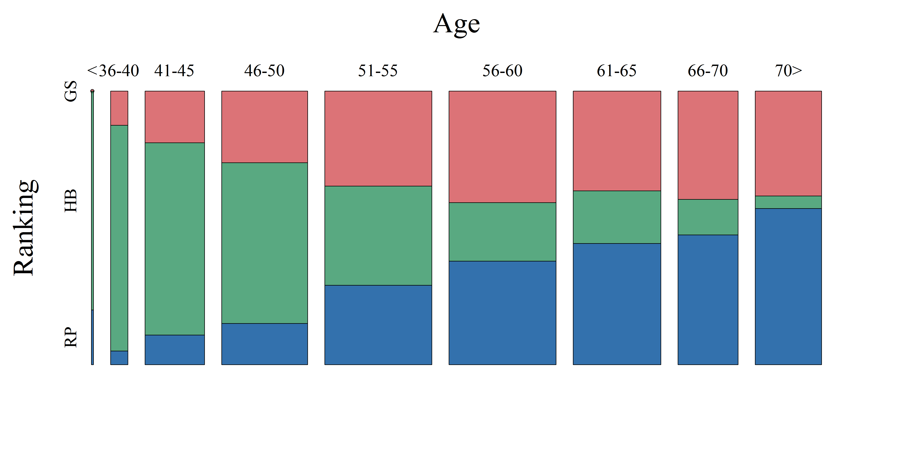

[](http://quantlet.de/index.php?p=info)

## [](http://quantlet.de/) **ARRmosagegr** [](http://quantlet.de/d3/ia)

```yaml

Name of QuantLet : ARRmosagegr

Published in : ARR - Academic Rankings Research

Description : 'Produces the mosaic plot of Top-700 scientists of Handelsblatt (HB), RePEc (RP) and
Google Scholar (GS) each one'

Keywords : 'mosaic-plot, plot, multivariate, data visualization, visualization, analysis,
descriptive-methods, graphical representation, descriptive statistics, descriptive, multivariate
analysis'

See also : 'ARRboxage, ARRboxgscit, ARRboxhb, ARRcormer, ARRdenmer2d, ARRdenmer3d, ARRhexage,
ARRhexcit, ARRhexhin, ARRhismer, ARRmosage, ARRmossub, ARRpcpgscit, ARRpcphb, ARRpcpmer, ARRpcprp,
ARRqrqqhb, ARRscaage, ARRscamer'

Author : Alona Zharova

Submitted : Sat, April 30 2016 by Alona Zharova, Marius Sterling

Datafile : 'ARRdata.csv - The data set contains different researcher (3218 rows) of either RePEc
(77 columns), Handelsblatt (48 columns) ranking or both and their Google Scholar data (16 columns)
as well as age and subject fields (2 columns)'

Output : 'Mosaic plot of HB (green), RP (blue) and GS (red) scores for Top-458 scientists within
each ranking system for December 2015. The width of the columns represents the number of persons
within each age group'

```




### R Code:
```r
# clear variables
rm(list=ls(all=TRUE))

# Install Packages
libraries = c("vcd")
lapply(libraries, function(x) if (!(x %in% installed.packages())) {install.packages(x)})
lapply(libraries, library, quietly = TRUE, character.only = TRUE)

# define colors
max      = 180
az_red   = rgb(138, 15, 20, alpha = 0.6 * max, maxColorValue = max)
az_green = rgb(0, 87, 44, alpha = 0.65 * max, maxColorValue = max)
az_blue  = rgb(0, 55, 108, alpha = 0.8 * max, maxColorValue = max)

# Setting Image options
font           = "serif" # font Times
fill_color     = c(az_red,az_green,az_blue)
fontsize_big   = 36
fontsize_small = 22
plotsize       = c(16,8)
res            = 300

# load data file
data = read.csv2("ARRdata.csv", sep = ";", dec = ",", header = T, stringsAsFactors = FALSE)
data = data[!is.na(data$age_combined), ]
subagehb = na.exclude(data[order(data$hb_commonscore, decreasing = T), 
                           grep(pattern = "age_combined|hb_commonscore", colnames(data))])
subagerp = na.exclude(data[order(as.numeric(data$rp_average_rank_score), decreasing = F), 
                           grep(pattern = "age_combined|rp_average_rank_score", colnames(data))])
subagegs = na.exclude(data[order(data$gs_total_cites, decreasing = T), 
                           grep(pattern = "age_combined|gs_total_cites",colnames(data))])
# data selection
m        = 600
len      = min(dim(subagehb)[1],dim(subagegs)[1],dim(subagerp)[1])
if (m<=len)len = m
subagehb = subagehb[1:len,]
subagerp = subagerp[1:len,]
subagegs = subagegs[1:len,]

# computing table for mosaic function
count    = data.frame()
ages     = c(35,40,45,50,55,60,65,70)
index    = 1
data1    = data[!is.na(data$age_combined),]
for (i in 1:(length(ages) + 1)) {
  for (rank in c("HB", "RP", "GS")) {
    tmp = get(paste0("subage", tolower(rank)))
    count[index, "X"] = index
    if (i == 1) {
      count[index, "Age"] = paste0("<", ages[i])
      tmp$age_combined
      count[index, "Freq"] = dim(tmp[tmp$age_combined <= ages[i], ])[1]
    } else {
      count[index, "Age"] = paste0(ages[i - 1] + 1, "-", ages[i])
      count[index, "Freq"] = dim(tmp[tmp$age_combined <= ages[i] & tmp$age_combined > 
                                       ages[i - 1], ])[1]
    }
    if (i == length(ages) + 1) {
      count[index, "Age"] = paste0(ages[i - 1], ">")
      count[index, "Freq"] = dim(tmp[tmp$age_combined > ages[i - 1], ])[1]
    }
    count[index, "Ranking"] = rank
    count[index, "HB"] = ifelse(rank == "HB", yes = "Yes", no = "No")
    count[index, "RP"] = ifelse(rank == "RP", yes = "Yes", no = "No")
    count[index, "GS"] = ifelse(rank == "GS", yes = "Yes", no = "No")
    index = index + 1
  }
}
count[count$Age == "<35", "Age"] = "<"


png(file = "ARRmosagegr.png", width = plotsize[1], height = plotsize[2], units = "in", 
    res = res, family = font)
# mosaic plot of age groups against Ranking groups
mosaic(~Age + Ranking, data = count, margins = unit(8, "lines"),
       gp = gpar(fill = matrix(rep(fill_color, times = 9),ncol = 3, byrow = T), col = 9), 
       shade = TRUE, direction = c("v", "h"), spacing = spacing_highlighting(start = unit(1, "lines")), 
       labeling_args = list(gp_labels = gpar(fontsize = fontsize_small, fontface = 1, fontfamily = font), 
                            gp_varnames = gpar(fontsize = fontsize_big, fontface = 1, fontfamily = font)), 
       keep_aspect_ratio = FALSE)
dev.off() 

```
