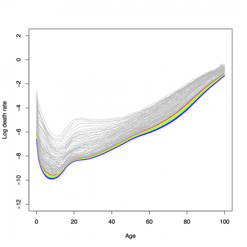
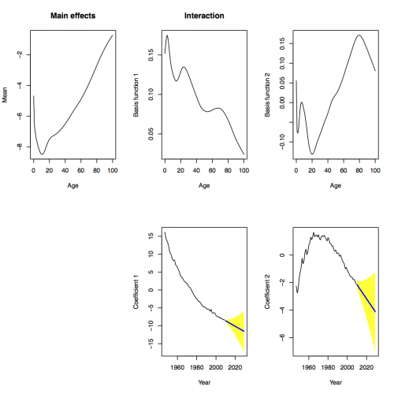

##  **SPAdemoHUJapan**

```yaml
Name of QuantLet : SPAdemoHUJapan

Published in : SPA - Stochastic Population Analysis

Description : 'Analyzes demographic trend (fPCA) and forecasts mortality 
and fertility in Japan using Hyndman-Ullah method.'

Keywords : 'FPCA, demography, fertility, forecast, mortality, plot, 
population, smoothing, time-series, visualization'

See also : SPAdemoLC, SPAdemodescriptive, SPAdemofcastaccuracy

Author : Lei Fang

Submitted : Thu, March 26 2015 by Awdesch Melzer

Datafile : Exposures_1x1.txt, JPNasfrRR.txt, JPNexposRR.txt, Mx_1x1.txt

Example :
- Hyndman-Ullah method for Japanese female mortality
- Forecast with Hyndman-Ullah method for Japanese female mortality

```






```r
# clear history and close windows
rm(list = ls(all = TRUE))
graphics.off()

# General settings
libraries = c("demography", "forecast")
lapply(libraries, function(x) if (!(x %in% installed.packages())) {
  install.packages(x)
})
lapply(libraries, library, quietly = TRUE, character.only = TRUE)

# please set working directory 
# setwd('C:/...')       # windows 
# setwd('/Users/...')   # mac os 
# setwd('~/...')        # linux

# set plotpar(mar=c(5, 5, 2, 2),cex.axis = 2, cex.lab = 2.5,cex.main=2.5)

# HU method
# Japan mortality data
# read data

japan1 = read.demogdata("Mx_1x1.txt", "Exposures_1x1.txt", type = "mortality", label = "Japan")
japan2 = extract.years(japan1, years = 1947:2009)
japan3 = extract.ages(japan2, 0:100)
japan  = smooth.demogdata(japan3, b = 65, k = 30)

# female
# fPCA analysis with 2 and 6 components respectively and forecasting
japan.mort.female.fit6   = fdm(japan, series = "female")
japan.mort.female.fit2   = fdm(japan, series = "female", order = 2)
japan.mort.female.fcast6 = forecast(japan.mort.female.fit6, h = 20)
japan.mort.female.fcast2 = forecast(japan.mort.female.fit2, h = 20)

# extract parameters mean, basis functions and correlated coefficients
mean.japan.female.mort   = japan.mort.female.fit6$basis[, 1]
phi1.japan.female.mort   = japan.mort.female.fit6$basis[, 2]
phi2.japan.female.mort   = japan.mort.female.fit6$basis[, 3]
beta1.japan.female.mort  = japan.mort.female.fit6$coeff[, 2]
beta2.japan.female.mort  = japan.mort.female.fit6$coeff[, 3]

# plot fPCA analysis
plot(japan.mort.female.fcast2, xlab2 = "Year", "c")

# plot forecasting graphs
plot(japan3, series = "female", ylim = c(-12, 2), col = "grey")
lines(japan.mort.female.fcast6)

# out of sample test
japan4     = extract.years(japan1, years = 1947:1989)
japan5     = extract.ages(japan4, 0:100)
japan.test = smooth.demogdata(japan5, b = 65, k = 30)

japan.mort.female.fit.test6   = fdm(japan.test, series = "female")
japan.mort.female.fcast.test6 = forecast(japan.mort.female.fit.test6, h = 20, level = 95)

df  = data.frame(x = 0:100, y = log(japan.mort.female.fcast.test6$rate$female[, 1]), 
  l = log(japan.mort.female.fcast.test6$rate$lower[, 1]), 
  u = log(japan.mort.female.fcast.test6$rate$upper[, 1]))
plot(df$x, df$y, ylim = c(-12, 2), ylab = "Log death rate", xlab = "Age", 
  type = "l", mar = c(5, 5, 2, 2), cex.axis = 1.5, cex.lab = 1.7)
polygon(c(df$x, rev(df$x)), c(df$l, rev(df$u)), col = "yellow", border = FALSE)
lines(df$x, df$y, lwd = 2)
lines(df$x, df$u, col = "blue", lty = 2)
lines(df$x, df$l, col = "blue", lty = 2)
lines(log(extract.years(japan3, 1990)$rate$female), col = "red", type = "p")

df  = data.frame(x = 0:100, y = log(japan.mort.female.fcast.test6$rate$female[, 10]), 
  l = log(japan.mort.female.fcast.test6$rate$lower[, 10]), 
  u = log(japan.mort.female.fcast.test6$rate$upper[, 10]))
plot(df$x, df$y, ylim = c(-12, 2), ylab = "Log death rate", xlab = "Age", 
  type = "l", mar = c(5, 5, 2, 2), cex.axis = 1.5, cex.lab = 1.7)
polygon(c(df$x, rev(df$x)), c(df$l, rev(df$u)), col = "yellow", border = FALSE)
lines(df$x, df$y, lwd = 2)
lines(df$x, df$u, col = "blue", lty = 2)
lines(df$x, df$l, col = "blue", lty = 2)
lines(log(extract.years(japan3, 1999)$rate$female), col = "red", type = "p")

df  = data.frame(x = 0:100, y = log(japan.mort.female.fcast.test6$rate$female[, 20]), 
  l = log(japan.mort.female.fcast.test6$rate$lower[, 20]), 
  u = log(japan.mort.female.fcast.test6$rate$upper[, 20]))
plot(df$x, df$y, ylim = c(-12, 2), ylab = "Log death rate", xlab = "Age", 
  type = "l", mar = c(5, 5, 2, 2), cex.axis = 1.5, cex.lab = 1.7)
polygon(c(df$x, rev(df$x)), c(df$l, rev(df$u)), col = "yellow", border = FALSE)
lines(df$x, df$y, lwd = 2)
lines(df$x, df$u, col = "blue", lty = 2)
lines(df$x, df$l, col = "blue", lty = 2)
lines(log(extract.years(japan3, 2009)$rate$female), col = "red", type = "p")

for (i in 1:20) {
  df = data.frame(x = 0:100, 
                  y = log(japan.mort.female.fcast.test6$rate$female[, i]), 
                  l = log(japan.mort.female.fcast.test6$rate$lower[, i]), 
                  u = log(japan.mort.female.fcast.test6$rate$upper[, i]))
  plot(df$x, df$y, ylim = c(-12, 2), main = substitute(paste(b, " (", a, "-step)"), 
    list(a = i, b = 1989 + i)), ylab = "Log death rate", xlab = "Age", type = "l")
  polygon(c(df$x, rev(df$x)), c(df$l, rev(df$u)), col = "yellow", border = FALSE)
  lines(df$x, df$y, lwd = 2)
  lines(df$x, df$u, col = "blue", lty = 2)
  lines(df$x, df$l, col = "blue", lty = 2)
  lines(log(extract.years(japan3, 1989 + i)$rate$female), col = "red", type = "p")
}

# male
japan.mort.male.fit6   = fdm(japan, series = "male")
japan.mort.male.fit2   = fdm(japan, series = "male", order = 2)
japan.mort.male.fcast6 = forecast(japan.mort.male.fit6, h = 20)
japan.mort.male.fcast2 = forecast(japan.mort.male.fit2, h = 20)

mean.japan.male.mort   = japan.mort.male.fit6$basis[, 1]
phi1.japan.male.mort   = japan.mort.male.fit6$basis[, 2]
phi2.japan.male.mort   = japan.mort.male.fit6$basis[, 3]
beta1.japan.male.mort  = japan.mort.male.fit6$coeff[, 2]
beta2.japan.male.mort  = japan.mort.male.fit6$coeff[, 3]

plot(japan.mort.male.fcast2, xlab2 = "Year", "c")
plot(japan3, series = "male", ylim = c(-12, 2), main = "", col = "grey")
lines(japan.mort.male.fcast6)

# out of sample
japan4     = extract.years(japan1, years = 1947:1989)
japan5     = extract.ages(japan4, 0:100)
japan.test = smooth.demogdata(japan5, b = 65, k = 30)

japan.mort.male.fit.test6   = fdm(japan.test, series = "male")
japan.mort.male.fcast.test6 = forecast(japan.mort.male.fit.test6, h = 20, level = 95)

df = data.frame(x = 0:100, y = log(japan.mort.male.fcast.test6$rate$male[, 1]), 
                l = log(japan.mort.male.fcast.test6$rate$lower[, 1]), 
                u = log(japan.mort.male.fcast.test6$rate$upper[, 1]))
plot(df$x, df$y, ylim = c(-12, 2), ylab = "Log death rate", xlab = "Age", 
  type = "l", mar = c(5, 5, 2, 2), cex.axis = 1.5, cex.lab = 1.7)
polygon(c(df$x, rev(df$x)), c(df$l, rev(df$u)), col = "yellow", border = FALSE)
lines(df$x, df$y, lwd = 2)
lines(df$x, df$u, col = "blue", lty = 2)
lines(df$x, df$l, col = "blue", lty = 2)
lines(log(extract.years(japan3, 1990)$rate$male), col = "red", type = "p")

df  = data.frame(x = 0:100, y = log(japan.mort.male.fcast.test6$rate$male[, 10]), 
  l = log(japan.mort.male.fcast.test6$rate$lower[, 10]), 
  u = log(japan.mort.male.fcast.test6$rate$upper[, 10]))
plot(df$x, df$y, ylim = c(-12, 2), main = "", ylab = "Log death rate", xlab = "Age", 
  type = "l", mar = c(5, 5, 2, 2), cex.axis = 1.5, cex.lab = 1.7)
polygon(c(df$x, rev(df$x)), c(df$l, rev(df$u)), col = "yellow", border = FALSE)
lines(df$x, df$y, lwd = 2)
lines(df$x, df$u, col = "blue", lty = 2)
lines(df$x, df$l, col = "blue", lty = 2)
lines(log(extract.years(japan3, 1999)$rate$male), col = "red", type = "p")

df  = data.frame(x = 0:100, y = log(japan.mort.male.fcast.test6$rate$male[, 20]), 
  l = log(japan.mort.male.fcast.test6$rate$lower[, 20]), 
  u = log(japan.mort.male.fcast.test6$rate$upper[, 20]))
plot(df$x, df$y, ylim = c(-12, 2), main = "", ylab = "Log death rate", xlab = "Age", 
  type = "l", mar = c(5, 5, 2, 2), cex.axis = 1.5, cex.lab = 1.7)
polygon(c(df$x, rev(df$x)), c(df$l, rev(df$u)), col = "yellow", border = FALSE)
lines(df$x, df$y, lwd = 2)
lines(df$x, df$u, col = "blue", lty = 2)
lines(df$x, df$l, col = "blue", lty = 2)
lines(log(extract.years(japan3, 2009)$rate$male), col = "red", type = "p")

for (i in 1:20) {
  df  = data.frame(x = 0:100, y = log(japan.mort.male.fcast.test6$rate$male[, i]), 
    l = log(japan.mort.male.fcast.test6$rate$lower[, i]), 
    u = log(japan.mort.male.fcast.test6$rate$upper[, i]))
  plot(df$x, df$y, ylim = c(-12, 2), main = substitute(paste(b, " (", a, "-step)"), 
    list(a = i, b = 1989 + i)), ylab = "Log death rate", xlab = "Age", type = "l")
  polygon(c(df$x, rev(df$x)), c(df$l, rev(df$u)), col = "yellow", border = FALSE)
  lines(df$x, df$y, lwd = 2)
  lines(df$x, df$u, col = "blue", lty = 2)
  lines(df$x, df$l, col = "blue", lty = 2)
  lines(log(extract.years(japan3, 1989 + i)$rate$male), col = "red", type = "p")
}

# fertility data

japan.fert1 = read.demogdata("JPNasfrRR.txt", "JPNexposRR.txt", type = "fertility", 
      label = "Japan")
japan.fert  = smooth.demogdata(japan.fert1, method = "cspline")

# female
japan.fert.female.fit6   = fdm(japan.fert, series = "female")
japan.fert.female.fit2   = fdm(japan.fert, series = "female", order = 2)
japan.fert.female.fcast6 = forecast(japan.fert.female.fit6, h = 20)
japan.fert.female.fcast2 = forecast(japan.fert.female.fit2, h = 20)

mean.japan.female.fert   = japan.fert.female.fit6$basis[, 1]
phi1.japan.female.fert   = japan.fert.female.fit6$basis[, 2]
phi2.japan.female.fert   = japan.fert.female.fit6$basis[, 3]
beta1.japan.female.fert  = japan.fert.female.fit6$coeff[, 2]
beta2.japan.female.fert  = japan.fert.female.fit6$coeff[, 3]

plot(japan.fert.female.fcast2, xlab2 = "Year", "c")
plot(japan.fert1, series = "female", ylim = c(0, 0.3), main = "", col = "grey")
lines(japan.fert.female.fcast6)

# out of sample
japan.fert2     = extract.years(japan.fert1, years = 1947:1989)
japan.fert.test = smooth.demogdata(japan.fert2, method = "cspline")

japan.fert.female.fit.test6 = fdm(japan.fert.test)
japan.fert.female.fcast.test6 = forecast(japan.fert.female.fit.test6, h = 20, level = 95)

df = data.frame(x = 12:55, y = japan.fert.female.fcast.test6$rate$female[, 1], 
                l = japan.fert.female.fcast.test6$rate$lower[, 1], 
                u = japan.fert.female.fcast.test6$rate$upper[, 1])
df[is.na(df)] = 0
plot(df$x, df$y, ylim = c(0, 0.5), main = "", ylab = "Fertility rate", xlab = "Age", 
  type = "l", mar = c(5, 5, 2, 2), cex.axis = 1.5, cex.lab = 1.7)
polygon(c(df$x, rev(df$x)), c(df$l, rev(df$u)), col = "yellow", border = FALSE)
lines(df$x, df$y, lwd = 2)
lines(df$x, df$u, col = "blue", lty = 2)
lines(df$x, df$l, col = "blue", lty = 2)
x1 = 12:55
lines(x1, extract.years(japan.fert1, 1990)$rate$female, col = "red", type = "p")

df = data.frame(x = 12:55, y = japan.fert.female.fcast.test6$rate$female[, 10], 
                l = japan.fert.female.fcast.test6$rate$lower[, 10], 
                u = japan.fert.female.fcast.test6$rate$upper[, 10])
df[is.na(df)] = 0
plot(df$x, df$y, ylim = c(0, 0.5), main = "", ylab = "Fertility rate", xlab = "Age", 
  type = "l", mar = c(5, 5, 2, 2), cex.axis = 1.5, cex.lab = 1.7)
polygon(c(df$x, rev(df$x)), c(df$l, rev(df$u)), col = "yellow", border = FALSE)
lines(df$x, df$y, lwd = 2)
lines(df$x, df$u, col = "blue", lty = 2)
lines(df$x, df$l, col = "blue", lty = 2)
x1 = 12:55
lines(x1, extract.years(japan.fert1, 1999)$rate$female, col = "red", type = "p")

df = data.frame(x = 12:55, y = japan.fert.female.fcast.test6$rate$female[, 20], 
                l = japan.fert.female.fcast.test6$rate$lower[, 20], 
                u = japan.fert.female.fcast.test6$rate$upper[, 20])
df[is.na(df)] = 0
plot(df$x, df$y, ylim = c(0, 0.5), main = "", ylab = "Fertility rate", xlab = "Age", 
  type = "l", mar = c(5, 5, 2, 2), cex.axis = 1.5, cex.lab = 1.7)
polygon(c(df$x, rev(df$x)), c(df$l, rev(df$u)), col = "yellow", border = FALSE)
lines(df$x, df$y, lwd = 2)
lines(df$x, df$u, col = "blue", lty = 2)
lines(df$x, df$l, col = "blue", lty = 2)
x1 = 12:55
lines(x1, extract.years(japan.fert1, 2009)$rate$female, col = "red", type = "p")

for (i in 1:20) {
  df  = data.frame(x = 12:55, y = japan.fert.female.fcast.test6$rate$female[, i], 
    l = japan.fert.female.fcast.test6$rate$lower[, i], 
    u = japan.fert.female.fcast.test6$rate$upper[, i])
  df[is.na(df)] = 0
  plot(df$x, df$y, ylim = c(0, 0.5), main = substitute(paste(b, " (", a, "-step)"), 
    list(a = i, b = 1989 + i)), ylab = "Fertility rate", xlab = "Age", type = "l")
  polygon(c(df$x, rev(df$x)), c(df$l, rev(df$u)), col = "yellow", border = FALSE)
  lines(df$x, df$y, lwd = 2)
  lines(df$x, df$u, col = "blue", lty = 2)
  lines(df$x, df$l, col = "blue", lty = 2)
  x1 = 12:55
  lines(x1, extract.years(japan.fert1, 1989 + i)$rate$female, col = "red", type = "p")
} 

```
