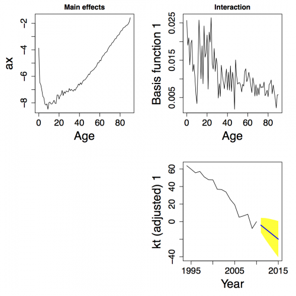

##  **SPAdemoLC**

```yaml
Name of QuantLet : SPAdemoLC

Published in : SPA - Stochastic Population Analysis

Description : 'Analyzes demographic trend (SVD) and forecasts mortality 
in Japan and Taiwan using Lee-Carter method.'

Keywords : 'demography, forecast, lee-carter-method, mortality, 
population, singular value, svd, time-series'

See also : SPAdemoHUJapan, SPAdemodescriptive, SPAdemofcastaccuracy

Author : Lei Fang

Submitted : Thu, March 26 2015 by Awdesch Melzer

Datafile : Exposures_1x1.txt, Exposures_1x1tw.txt, Mx_1x1.txt, Mx_1x1tw.txt

Example :
- Plot of mortality and fertility

```




```r
# clear history and close windows
rm(list = ls(all = TRUE))
graphics.off()

# General settings
libraries = c("demography", "forecast")
lapply(libraries, function(x) if (!(x %in% installed.packages())) {
  install.packages(x)
})
lapply(libraries, library, quietly = TRUE, character.only = TRUE)

# please set working directory
# setwd("C:/...")     # windows
# setwd("/Users/...") # mac os
# setwd("~/...")      # linux

# set plot
par(mar = c(5, 5, 2, 2), cex.axis = 1.5, cex.lab = 2)

# Lee-Carter model for mortality (only)
# Japan
# read data
japan1 = read.demogdata("Mx_1x1.txt", "Exposures_1x1.txt", type = "mortality", label = "Japan")
japan2 = extract.years(japan1, years = 1947:2009)
japan3 = extract.ages(japan2, 0:100)

# female
# Lee-Carter method analysis and forecast of next 20 years
japan.lca.female     = lca(japan3, series = "female", adjust = "e0")
ax.japan.female.mort = japan.lca.female$ax
bx.japan.female.mort = japan.lca.female$bx
kt.japan.female.mort = japan.lca.female$kt
japan.female.fcast   = forecast(japan.lca.female, 20)

plot(ax.japan.female.mort, xlab = "Age", ylab = "ax", type = "l", col = "green", 
  lwd = 3, ylim = c(-9, 0))
dev.new()
plot(bx.japan.female.mort, xlab = "Age", ylab = "bx", type = "l", col = "red", 
  lwd = 3, ylim = c(0, 0.025))
dev.new()
plot(kt.japan.female.mort, xlab = "Year", ylab = "kt", type = "l", col = "blue", 
  lwd = 3, ylim = c(-100, 150))
dev.new()
plot(japan.lca.female, main = "LC Model: Japan female Mortality")
dev.new()
plot(japan3, series = "female", ylim = c(-12, 2), col = "grey")
lines(japan.female.fcast)
dev.new()
plot(japan.female.fcast, "c")

# male
japan.lca.male     = lca(japan3, series = "male", adjust = "e0")
ax.japan.male.mort = japan.lca.male$ax
bx.japan.male.mort = japan.lca.male$bx
kt.japan.male.mort = japan.lca.male$kt
japan.male.fcast   = forecast(japan.lca.male, 20)
dev.new()
plot(ax.japan.male.mort, xlab = "Age", ylab = "ax", type = "l", col = "green", 
  lwd = 3, ylim = c(-9, 0))
dev.new()
plot(bx.japan.male.mort, xlab = "Age", ylab = "bx", type = "l", col = "red", 
  lwd = 3, ylim = c(0, 0.025))
dev.new()
plot(kt.japan.male.mort, xlab = "Year", ylab = "kt", type = "l", col = "blue", 
  lwd = 3, ylim = c(-100, 150))
dev.new()
plot(japan.lca.male, main = "LC Model: Japan male Mortality")
dev.new()
plot(japan3, series = "male", ylim = c(-12, 2), col = "grey")
lines(japan.male.fcast)
dev.new()
plot(japan.male.fcast, "c")

# Taiwan
taiwan1 = read.demogdata("Mx_1x1tw.txt", "Exposures_1x1tw.txt", type = "mortality", 
  label = "taiwan")
taiwan2 = extract.years(taiwan1, years = 1976:2010)
taiwan3 = extract.ages(taiwan2, 0:100)

# female
taiwan.lca.female     = lca(taiwan3, series = "female", adjust = "e0")
ax.taiwan.female.mort = taiwan.lca.female$ax
bx.taiwan.female.mort = taiwan.lca.female$bx
kt.taiwan.female.mort = taiwan.lca.female$kt
taiwan.female.fcast   = forecast(taiwan.lca.female, 10)
dev.new()
plot(ax.taiwan.female.mort, xlab = "Age", ylab = "ax", type = "l", col = "green", 
  lwd = 3, ylim = c(-9, 0))
dev.new()
plot(bx.taiwan.female.mort, xlab = "Age", ylab = "bx", type = "l", col = "red", 
  lwd = 3, ylim = c(0, 0.03))
dev.new()
plot(kt.taiwan.female.mort, xlab = "Year", ylab = "kt", type = "l", col = "blue", 
  lwd = 3, ylim = c(-50, 40))
dev.new()
plot(taiwan.lca.female, main = "LC Model: taiwan female Mortality")
dev.new()
plot(taiwan3, series = "female", ylim = c(-12, 2), col = "grey")
lines(taiwan.female.fcast)
dev.new()
plot(taiwan.female.fcast, "c")

# male
taiwan.lca.male     = lca(taiwan3, series = "male", adjust = "e0")
ax.taiwan.male.mort = taiwan.lca.male$ax
bx.taiwan.male.mort = taiwan.lca.male$bx
kt.taiwan.male.mort = taiwan.lca.male$kt
taiwan.male.fcast   = forecast(taiwan.lca.male, 10)
dev.new()
plot(ax.taiwan.male.mort, xlab = "Age", ylab = "ax", type = "l", col = "green", 
  lwd = 3, ylim = c(-9, 0))
dev.new()
plot(bx.taiwan.male.mort, xlab = "Age", ylab = "bx", type = "l", col = "red", 
  lwd = 3, ylim = c(0, 0.03))
dev.new()
plot(kt.taiwan.male.mort, xlab = "Year", ylab = "kt", type = "l", col = "blue", 
  lwd = 3, ylim = c(-50, 40))
dev.new()
plot(taiwan.lca.male, main = "LC Model: taiwan male Mortality")
dev.new()
plot(taiwan3, series = "male", ylim = c(-12, 2), col = "grey")
lines(taiwan.male.fcast)
dev.new()
plot(taiwan.male.fcast, "c") 

```
