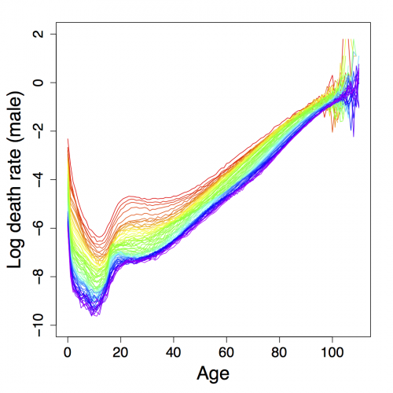

##  **SPAdemodescriptive**

```yaml
Name of QuantLet : SPAdemodescriptive

Published in : SPA - Stochastic Population Analysis

Description : 'Plots time series graphs of mortality and fertility of 
Japan and Taiwan based on historical data sets.'

Keywords : 'demography, descriptive-statistics, fertility, mortality, 
plot, population, time-series'

See also : SPAdemoHUJapan, SPAdemoLC, SPAdemofcastaccuracy

Author : Lei Fang

Submitted : Thu, March 26 2015 by Awdesch Melzer

Datafile : 'Exposures_1x1.txt, Exposures_1x1tw.txt, JPNasfrRR.txt, 
JPNexposRR.txt, Mx_1x1.txt, Mx_1x1tw.txt, TWNasfrRR.txt, TWNexposRR.txt'

Example : 
- Mortality of Japan (male)

```




```r
# clear history and close windows
rm(list = ls(all = TRUE))
graphics.off()

# General settings
libraries = c("demography", "forecast")
lapply(libraries, function(x) if (!(x %in% installed.packages())) {
  install.packages(x)
})
lapply(libraries, library, quietly = TRUE, character.only = TRUE)

# please set working directory 
# setwd('C:/...')        # windows 
# setwd('/Users/...')    # mac os 
# setwd('~/...')         # linux

# descriptive analysis
# Japan mortality data
par(mar = c(5, 5, 2, 2), cex.axis = 1.5, cex.lab = 2)
japan1 = read.demogdata("Mx_1x1.txt", "Exposures_1x1.txt", type = "mortality", label = "Japan")
plot(japan1, series = "male", ylim = c(-10, 2), xlim = c(0, 110), ylab = "Log death rate (male)")
plot(japan1, series = "female", ylim = c(-10, 2), xlim = c(0, 110), ylab = "Log death rate (female)")

# fertility data
japan.fert = read.demogdata("JPNasfrRR.txt", "JPNexposRR.txt", type = "fertility", 
                            label = "Japan")
plot(japan.fert, ylim = c(0, 0.3), xlim = c(10, 55))

# Taiwan mortality data
taiwan1 = read.demogdata("Mx_1x1tw.txt", "Exposures_1x1tw.txt", type = "mortality", 
                         label = "Taiwan")
plot(taiwan1, series = "male", ylim = c(-10, 2), xlim = c(0, 110), ylab = "Log death rate (male)")
plot(taiwan1, series = "female", ylim = c(-10, 2), xlim = c(0, 110), ylab = "Log death rate (female)")

# fertility data
taiwan.fert = read.demogdata("TWNasfrRR.txt", "TWNexposRR.txt", type = "fertility", 
                             label = "Taiwan")
plot(taiwan.fert, ylim = c(0, 0.3), xlim = c(10, 55)) 

```
