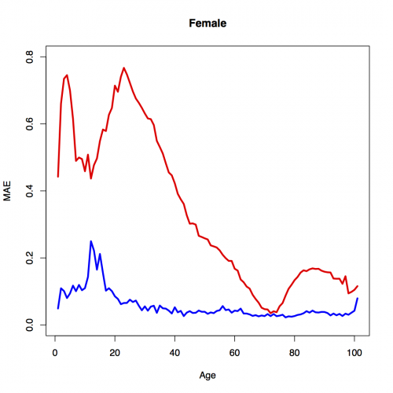

##  **SPAdemofcastaccuracy**

```yaml
Name of QuantLet : SPAdemofcastaccuracy

Published in : SPA - Stochastic Population Analysis

Description : 'Compares and plots forecast accuracy using Lee-Carter 
and Hyndman-Ullah methods for mortality data of Japan, and computes Diebold 
Mariano statistics.'

Keywords : 'demography, diebold-mariano-test, error, forecast, lee-carter-method, 
mortality, plot, population, smoothing, time-series'

See also : SPAdemoHUJapan, SPAdemoLC, SPAdemodescriptive

Author : Lei Fang

Submitted : Thu, March 26 2015 by Awdesch Melzer

Datafile : Exposures_1x1.txt, Mx_1x1.txt

Example : 
- MAE for LC and HU methods

```




```r
# clear history and close windows
rm(list = ls(all = TRUE))
graphics.off()

# General settings
libraries = c("demography", "forecast")
lapply(libraries, function(x) if (!(x %in% installed.packages())) {
  install.packages(x)
})
lapply(libraries, library, quietly = TRUE, character.only = TRUE)

# please set working directory
# setwd("C:/...")     # windows
# setwd("/Users/...") # mac os
# setwd("~/...")      # linux

# set plot
par(mar = c(5, 5, 2, 2), cex.axis = 1.5, cex.lab = 2)

# Japan mortality data
# read data
japan1 = read.demogdata("Mx_1x1.txt", "Exposures_1x1.txt", type = "mortality", label = "Japan")
japan2 = extract.years(japan1, years = 1947:2009)
japan3 = extract.ages(japan2, 0:100)
japan  = smooth.demogdata(japan3, b = 65, k = 30)


# 1-step ahead
# female Lee-Carter model
# loops of one-year ahead forecasting

for (i in 1990:2009) {
  japan.lc                = extract.years(japan3, 1947:i - 1)
  japan.lca.female        = lca(japan.lc, series = "female", adjust = "e0")
  japan.female.fcast      = forecast(japan.lca.female, 1)
  japan.female.mort.error = compare.demogdata(japan3, japan.female.fcast)
  temp1 = paste("mae.female.lc.age.", i, sep = "")
  assign(temp1, japan.female.mort.error$mean.error[, "MAE"])
  temp2 = paste("me.female.lc.age.", i, sep = "")
  assign(temp2, japan.female.mort.error$mean.error[, "ME"])
  temp3 = paste("mae.female.lc.year.", i, sep = "")
  assign(temp3, japan.female.mort.error$int.error[, "IAE"])
  temp4 = paste("me.female.lc.year.", i, sep = "")
  assign(temp4, japan.female.mort.error$int.error[, "IE"])
}

# assign the error terms into a new dataframe
t1 = data.frame(mae.female.lc.age.1990, mae.female.lc.age.1991, mae.female.lc.age.1992, 
  mae.female.lc.age.1993, mae.female.lc.age.1994, mae.female.lc.age.1995, mae.female.lc.age.1996, 
  mae.female.lc.age.1997, mae.female.lc.age.1998, mae.female.lc.age.1999, mae.female.lc.age.2000, 
  mae.female.lc.age.2001, mae.female.lc.age.2002, mae.female.lc.age.2003, mae.female.lc.age.2004, 
  mae.female.lc.age.2005, mae.female.lc.age.2006, mae.female.lc.age.2007, mae.female.lc.age.2008, 
  mae.female.lc.age.2009)

mae.female.lc.age = rowMeans(t1)
t2 = data.frame(me.female.lc.age.1990, me.female.lc.age.1991, me.female.lc.age.1992, 
  me.female.lc.age.1993, me.female.lc.age.1994, me.female.lc.age.1995, me.female.lc.age.1996, 
  me.female.lc.age.1997, me.female.lc.age.1998, me.female.lc.age.1999, me.female.lc.age.2000, 
  me.female.lc.age.2001, me.female.lc.age.2002, me.female.lc.age.2003, me.female.lc.age.2004, 
  me.female.lc.age.2005, me.female.lc.age.2006, me.female.lc.age.2007, me.female.lc.age.2008, 
  me.female.lc.age.2009)

me.female.lc.age = rowMeans(t1)
mae.female.lc.year.temp = t(data.frame(mae.female.lc.year.1990, mae.female.lc.year.1991, 
  mae.female.lc.year.1992, mae.female.lc.year.1993, mae.female.lc.year.1994, mae.female.lc.year.1995, 
  mae.female.lc.year.1996, mae.female.lc.year.1997, mae.female.lc.year.1998, mae.female.lc.year.1999, 
  mae.female.lc.year.2000, mae.female.lc.year.2001, mae.female.lc.year.2002, mae.female.lc.year.2003, 
  mae.female.lc.year.2004, mae.female.lc.year.2005, mae.female.lc.year.2006, mae.female.lc.year.2007, 
  mae.female.lc.year.2008, mae.female.lc.year.2009))

mae.female.lc.year = mae.female.lc.year.temp/101
me.female.lc.year.temp = t(data.frame(me.female.lc.year.1990, me.female.lc.year.1991, 
  me.female.lc.year.1992, me.female.lc.year.1993, me.female.lc.year.1994, me.female.lc.year.1995, 
  me.female.lc.year.1996, me.female.lc.year.1997, me.female.lc.year.1998, me.female.lc.year.1999, 
  me.female.lc.year.2000, me.female.lc.year.2001, me.female.lc.year.2002, me.female.lc.year.2003, 
  me.female.lc.year.2004, me.female.lc.year.2005, me.female.lc.year.2006, me.female.lc.year.2007, 
  me.female.lc.year.2008, me.female.lc.year.2009))
me.female.lc.year = me.female.lc.year.temp/101

# HU method
# loops of one-year ahead forecasting

for (i in 1990:2009) {
  japan.hu                   = extract.years(japan, 1947:i - 1)
  japan.hu.female            = fdm(japan.hu, series = "female")
  japan.female.hu.fcast      = forecast(japan.hu.female, 1)
  japan.female.hu.mort.error = compare.demogdata(japan3, japan.female.hu.fcast)
  temp1 = paste("mae.female.hu.age.", i, sep = "")
  assign(temp1, japan.female.hu.mort.error$mean.error[, "MAE"])
  temp2 = paste("me.female.hu.age.", i, sep = "")
  assign(temp2, japan.female.hu.mort.error$mean.error[, "ME"])
  temp3 = paste("mae.female.hu.year.", i, sep = "")
  assign(temp3, japan.female.hu.mort.error$int.error[, "IAE"])
  temp4 = paste("me.female.hu.year.", i, sep = "")
  assign(temp4, japan.female.hu.mort.error$int.error[, "IE"])
}

# assign the error terms into a new dataframe
t3 = data.frame(mae.female.hu.age.1990, mae.female.hu.age.1991, mae.female.hu.age.1992, 
  mae.female.hu.age.1993, mae.female.hu.age.1994, mae.female.hu.age.1995, mae.female.hu.age.1996, 
  mae.female.hu.age.1997, mae.female.hu.age.1998, mae.female.hu.age.1999, mae.female.hu.age.2000, 
  mae.female.hu.age.2001, mae.female.hu.age.2002, mae.female.hu.age.2003, mae.female.hu.age.2004, 
  mae.female.hu.age.2005, mae.female.hu.age.2006, mae.female.hu.age.2007, mae.female.hu.age.2008, 
  mae.female.hu.age.2009)
mae.female.hu.age = rowMeans(t3)

t4 = data.frame(me.female.hu.age.1990, me.female.hu.age.1991, me.female.hu.age.1992, 
  me.female.hu.age.1993, me.female.hu.age.1994, me.female.hu.age.1995, me.female.hu.age.1996, 
  me.female.hu.age.1997, me.female.hu.age.1998, me.female.hu.age.1999, me.female.hu.age.2000, 
  me.female.hu.age.2001, me.female.hu.age.2002, me.female.hu.age.2003, me.female.hu.age.2004, 
  me.female.hu.age.2005, me.female.hu.age.2006, me.female.hu.age.2007, me.female.hu.age.2008, 
  me.female.hu.age.2009)

me.female.hu.age = rowMeans(t4)
mae.female.hu.year.temp = t(data.frame(mae.female.hu.year.1990, mae.female.hu.year.1991, 
  mae.female.hu.year.1992, mae.female.hu.year.1993, mae.female.hu.year.1994, mae.female.hu.year.1995, 
  mae.female.hu.year.1996, mae.female.hu.year.1997, mae.female.hu.year.1998, mae.female.hu.year.1999, 
  mae.female.hu.year.2000, mae.female.hu.year.2001, mae.female.hu.year.2002, mae.female.hu.year.2003, 
  mae.female.hu.year.2004, mae.female.hu.year.2005, mae.female.hu.year.2006, mae.female.hu.year.2007, 
  mae.female.hu.year.2008, mae.female.hu.year.2009))
mae.female.hu.year = mae.female.hu.year.temp/101

me.female.hu.year.temp = t(data.frame(me.female.hu.year.1990, me.female.hu.year.1991, 
  me.female.hu.year.1992, me.female.hu.year.1993, me.female.hu.year.1994, me.female.hu.year.1995, 
  me.female.hu.year.1996, me.female.hu.year.1997, me.female.hu.year.1998, me.female.hu.year.1999, 
  me.female.hu.year.2000, me.female.hu.year.2001, me.female.hu.year.2002, me.female.hu.year.2003, 
  me.female.hu.year.2004, me.female.hu.year.2005, me.female.hu.year.2006, me.female.hu.year.2007, 
  me.female.hu.year.2008, me.female.hu.year.2009))
me.female.hu.year = me.female.hu.year.temp/101

# male Lee-Carter model
for (i in 1990:2009) {
  japan.lc              = extract.years(japan3, 1947:i - 1)
  japan.lca.male        = lca(japan.lc, series = "male", adjust = "e0")
  japan.male.fcast      = forecast(japan.lca.male, 1)
  japan.male.mort.error = compare.demogdata(japan3, japan.male.fcast)
  temp1 = paste("mae.male.lc.age.", i, sep = "")
  assign(temp1, japan.male.mort.error$mean.error[, "MAE"])
  temp2 = paste("me.male.lc.age.", i, sep = "")
  assign(temp2, japan.male.mort.error$mean.error[, "ME"])
  temp3 = paste("mae.male.lc.year.", i, sep = "")
  assign(temp3, japan.male.mort.error$int.error[, "IAE"])
  temp4 = paste("me.male.lc.year.", i, sep = "")
  assign(temp4, japan.male.mort.error$int.error[, "IE"])
}

t1 = data.frame(mae.male.lc.age.1990, mae.male.lc.age.1991, mae.male.lc.age.1992, 
  mae.male.lc.age.1993, mae.male.lc.age.1994, mae.male.lc.age.1995, mae.male.lc.age.1996, 
  mae.male.lc.age.1997, mae.male.lc.age.1998, mae.male.lc.age.1999, mae.male.lc.age.2000, 
  mae.male.lc.age.2001, mae.male.lc.age.2002, mae.male.lc.age.2003, mae.male.lc.age.2004, 
  mae.male.lc.age.2005, mae.male.lc.age.2006, mae.male.lc.age.2007, mae.male.lc.age.2008, 
  mae.male.lc.age.2009)
mae.male.lc.age = rowMeans(t1)

t2 = data.frame(me.male.lc.age.1990, me.male.lc.age.1991, me.male.lc.age.1992, me.male.lc.age.1993, 
  me.male.lc.age.1994, me.male.lc.age.1995, me.male.lc.age.1996, me.male.lc.age.1997, 
  me.male.lc.age.1998, me.male.lc.age.1999, me.male.lc.age.2000, me.male.lc.age.2001, 
  me.male.lc.age.2002, me.male.lc.age.2003, me.male.lc.age.2004, me.male.lc.age.2005, 
  me.male.lc.age.2006, me.male.lc.age.2007, me.male.lc.age.2008, me.male.lc.age.2009)
me.male.lc.age = rowMeans(t1)

mae.male.lc.year.temp = t(data.frame(mae.male.lc.year.1990, mae.male.lc.year.1991, 
  mae.male.lc.year.1992, mae.male.lc.year.1993, mae.male.lc.year.1994, mae.male.lc.year.1995, 
  mae.male.lc.year.1996, mae.male.lc.year.1997, mae.male.lc.year.1998, mae.male.lc.year.1999, 
  mae.male.lc.year.2000, mae.male.lc.year.2001, mae.male.lc.year.2002, mae.male.lc.year.2003, 
  mae.male.lc.year.2004, mae.male.lc.year.2005, mae.male.lc.year.2006, mae.male.lc.year.2007, 
  mae.male.lc.year.2008, mae.male.lc.year.2009))
mae.male.lc.year = mae.male.lc.year.temp/101

me.male.lc.year.temp = t(data.frame(me.male.lc.year.1990, me.male.lc.year.1991, me.male.lc.year.1992, 
  me.male.lc.year.1993, me.male.lc.year.1994, me.male.lc.year.1995, me.male.lc.year.1996, 
  me.male.lc.year.1997, me.male.lc.year.1998, me.male.lc.year.1999, me.male.lc.year.2000, 
  me.male.lc.year.2001, me.male.lc.year.2002, me.male.lc.year.2003, me.male.lc.year.2004, 
  me.male.lc.year.2005, me.male.lc.year.2006, me.male.lc.year.2007, me.male.lc.year.2008, 
  me.male.lc.year.2009))
me.male.lc.year = me.male.lc.year.temp/101

# HU method
for (i in 1990:2009) {
  japan.hu                 = extract.years(japan, 1947:i - 1)
  japan.hu.male            = fdm(japan.hu, series = "male")
  japan.male.hu.fcast      = forecast(japan.hu.male, 1)
  japan.male.hu.mort.error = compare.demogdata(japan3, japan.male.hu.fcast)
  temp1 = paste("mae.male.hu.age.", i, sep = "")
  assign(temp1, japan.male.hu.mort.error$mean.error[, "MAE"])
  temp2 = paste("me.male.hu.age.", i, sep = "")
  assign(temp2, japan.male.hu.mort.error$mean.error[, "ME"])
  temp3 = paste("mae.male.hu.year.", i, sep = "")
  assign(temp3, japan.male.hu.mort.error$int.error[, "IAE"])
  temp4 = paste("me.male.hu.year.", i, sep = "")
  assign(temp4, japan.male.hu.mort.error$int.error[, "IE"])
}

t3 = data.frame(mae.male.hu.age.1990, mae.male.hu.age.1991, mae.male.hu.age.1992, 
  mae.male.hu.age.1993, mae.male.hu.age.1994, mae.male.hu.age.1995, mae.male.hu.age.1996, 
  mae.male.hu.age.1997, mae.male.hu.age.1998, mae.male.hu.age.1999, mae.male.hu.age.2000, 
  mae.male.hu.age.2001, mae.male.hu.age.2002, mae.male.hu.age.2003, mae.male.hu.age.2004, 
  mae.male.hu.age.2005, mae.male.hu.age.2006, mae.male.hu.age.2007, mae.male.hu.age.2008, 
  mae.male.hu.age.2009)
mae.male.hu.age = rowMeans(t3)

t4 = data.frame(me.male.hu.age.1990, me.male.hu.age.1991, me.male.hu.age.1992, me.male.hu.age.1993, 
  me.male.hu.age.1994, me.male.hu.age.1995, me.male.hu.age.1996, me.male.hu.age.1997, 
  me.male.hu.age.1998, me.male.hu.age.1999, me.male.hu.age.2000, me.male.hu.age.2001, 
  me.male.hu.age.2002, me.male.hu.age.2003, me.male.hu.age.2004, me.male.hu.age.2005, 
  me.male.hu.age.2006, me.male.hu.age.2007, me.male.hu.age.2008, me.male.hu.age.2009)
me.male.hu.age = rowMeans(t4)

mae.male.hu.year.temp = t(data.frame(mae.male.hu.year.1990, mae.male.hu.year.1991, 
  mae.male.hu.year.1992, mae.male.hu.year.1993, mae.male.hu.year.1994, mae.male.hu.year.1995, 
  mae.male.hu.year.1996, mae.male.hu.year.1997, mae.male.hu.year.1998, mae.male.hu.year.1999, 
  mae.male.hu.year.2000, mae.male.hu.year.2001, mae.male.hu.year.2002, mae.male.hu.year.2003, 
  mae.male.hu.year.2004, mae.male.hu.year.2005, mae.male.hu.year.2006, mae.male.hu.year.2007, 
  mae.male.hu.year.2008, mae.male.hu.year.2009))
mae.male.hu.year = mae.male.hu.year.temp/101

me.male.hu.year.temp = t(data.frame(me.male.hu.year.1990, me.male.hu.year.1991, me.male.hu.year.1992, 
  me.male.hu.year.1993, me.male.hu.year.1994, me.male.hu.year.1995, me.male.hu.year.1996, 
  me.male.hu.year.1997, me.male.hu.year.1998, me.male.hu.year.1999, me.male.hu.year.2000, 
  me.male.hu.year.2001, me.male.hu.year.2002, me.male.hu.year.2003, me.male.hu.year.2004, 
  me.male.hu.year.2005, me.male.hu.year.2006, me.male.hu.year.2007, me.male.hu.year.2008, 
  me.male.hu.year.2009))
me.male.hu.year = me.male.hu.year.temp/101

# forecast accuracy comparison plot
plot(mae.female.lc.age, xlab = "Age", ylab = "MAE", main = "Female", type = "l", 
  lwd = 3, col = "red", ylim = c(0, 0.8))
lines(mae.female.hu.age, type = "l", lwd = 3, col = "blue")

plot(mae.male.lc.age, xlab = "Age", ylab = "MAE", main = "Male", type = "l", lwd = 3, 
  col = "red", ylim = c(0, 0.8))
lines(mae.male.hu.age, type = "l", lwd = 3, col = "blue")

plot(1990:2009, mae.male.lc.year[, "IAE"], xlab = "Year", ylab = "MAE", main = "Female", 
  type = "l", lwd = 3, col = "red", ylim = c(0, 0.2))
lines(1990:2009, mae.female.hu.year[, "IAE"], type = "l", lwd = 3, col = "blue")

plot(1990:2009, mae.male.lc.year[, "IAE"], xlab = "Year", ylab = "MAE", main = "Male", 
  type = "l", lwd = 3, col = "red", ylim = c(0, 0.2))
lines(1990:2009, mae.male.hu.year[, "IAE"], type = "l", lwd = 3, col = "blue")

plot(me.female.lc.age, xlab = "Age", ylab = "ME", main = "Female", type = "l", lwd = 3, 
  col = "red", ylim = c(-0.1, 0.8))
lines(me.female.hu.age, type = "l", lwd = 3, col = "blue")

plot(me.male.lc.age, xlab = "Age", ylab = "ME", main = "Male", type = "l", lwd = 3, 
  col = "red", ylim = c(-0.1, 0.8))
lines(me.male.hu.age, type = "l", lwd = 3, col = "blue")

plot(1990:2009, me.female.lc.year[, "IE"], xlab = "Year", ylab = "ME", main = "Female", 
  type = "l", lwd = 3, col = "red", ylim = c(-0.35, 0.1))
lines(1990:2009, me.female.hu.year[, "IE"], type = "l", lwd = 3, col = "blue")

plot(1990:2009, me.male.lc.year[, "IE"], xlab = "Year", ylab = "ME", main = "Male", 
  type = "l", lwd = 3, col = "red", ylim = c(-0.35, 0.1))
lines(1990:2009, me.male.hu.year[, "IE"], type = "l", lwd = 3, col = "blue")

# ratio between the MAEs of LC and HU methods
ratio.female.age = mae.female.lc.age/mae.female.hu.age
plot(ratio.female.age, type = "l", xlab = "Age", ylab = "MAE ratio (LC/HU)", main = "Female", 
  lwd = 3, col = "cadetblue ", ylim = c(0, 15.5))

ratio.male.age = mae.male.lc.age/mae.male.hu.age
plot(ratio.male.age, type = "l", xlab = "Age", ylab = "MAE ratio (LC/HU)", main = "Male", 
  lwd = 3, col = "cadetblue ", ylim = c(0, 15.5))

ratio.female.year = mae.female.lc.year/mae.female.hu.year
plot(1990:2009, ratio.female.year[, "IAE"], type = "l", xlab = "Year", ylab = "MAE ratio (LC/HU)", 
  main = "Female", lwd = 3, col = "cadetblue ", ylim = c(0, 9))

ratio.male.year = mae.male.lc.year/mae.male.hu.year
plot(1990:2009, ratio.male.year[, "IAE"], type = "l", xlab = "Year", ylab = "MAE ratio (LC/HU)", 
  main = "Male", lwd = 3, col = "cadetblue ", ylim = c(0, 9))

# Diebold-Mariano Test
dm.test(mae.female.lc.year, mae.female.hu.year, alternative = c("greater"), h = 1, 
  power = 1)
dm.test(mae.male.lc.year, mae.male.hu.year, alternative = c("greater"), h = 1, power = 1)
dm.test(mae.female.lc.age, mae.female.hu.age, alternative = c("greater"), h = 1, 
  power = 1)
dm.test(mae.male.lc.age, mae.male.hu.age, alternative = c("greater"), h = 1, power = 1) 

```
